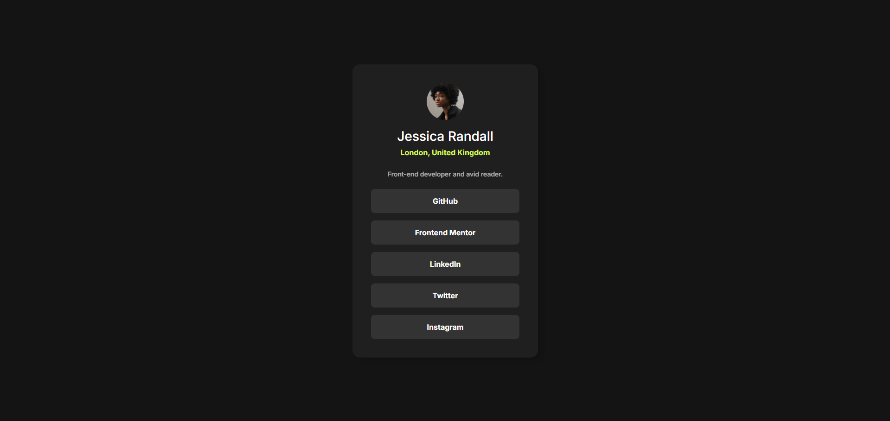

# Frontend Mentor - Social links profile solution

This is a solution to the [Social links profile challenge on Frontend Mentor](https://www.frontendmentor.io/challenges/social-links-profile-UG32l9m6dQ). Frontend Mentor challenges help you improve your coding skills by building realistic projects.

## Table of contents

- [Overview](#overview)
  - [The challenge](#the-challenge)
  - [Screenshot](#screenshot)
  - [Links](#links)
- [My process](#my-process)
  - [Built with](#built-with)
  - [What I learned](#what-i-learned)
  - [Continued development](#continued-development)
  - [Useful resources](#useful-resources)
- [Author](#author)

## Overview

### The challenge

Users should be able to:

- See hover and focus states for all interactive elements on the page

### Screenshot



### Links

- Solution URL: https://github.com/PolariSystem/social-links-profile
- Live Site URL: https://polarisystem.github.io/social-links-profile/

## My process

### Built with

- Semantic HTML5 markup
- CSS custom properties (variables)
- Flexbox
- Mobile-first workflow
- Google Fonts (Inter)

### What I learned

Working on this project, I reinforced several important concepts:

**CSS Custom Properties (Variables):**

```css
:root {
  --primary-green: hsl(75, 94%, 57%);
  --secondary-white: hsl(0, 0%, 100%);
  --grey-900: hsl(0, 0%, 8%);
}
```

Using CSS variables makes it much easier to maintain consistent colors and spacing throughout the project.

**Flexbox Layout:**

```css
.card {
  display: flex;
  flex-direction: column;
  align-items: center;
  text-align: center;
}
```

Flexbox made it straightforward to center content and create a well-organized layout.

**Semantic HTML & Accessibility:**
Using semantic elements like `<nav>`, `<section>`, and `<main>` along with proper ARIA labels (`aria-labelledby`, `aria-label`) helps create more accessible websites that work well for all users.

### Continued development

In future projects, I want to focus on:

- Implementing smooth transitions and animations for interactive elements
- Expanding my knowledge of responsive design for different screen sizes
- Learning JavaScript to add more interactivity to projects
- Exploring CSS Grid for more complex layouts

### Useful resources

- [MDN: CSS Flexbox](https://developer.mozilla.org/en-US/docs/Web/CSS/CSS_Flexible_Box_Layout) - Essential reference for flexbox properties
- [MDN: CSS Custom Properties](https://developer.mozilla.org/en-US/docs/Web/CSS/--*) - Great documentation on using CSS variables
- [Frontend Mentor Community](https://www.frontendmentor.io/community) - Amazing community for feedback and support

## Author

- Frontend Mentor - [@PolariSystem](https://www.frontendmentor.io/profile/PolariSystem)
- GitHub - [@PolariSystem](https://www.github.com/PolariSystem)
